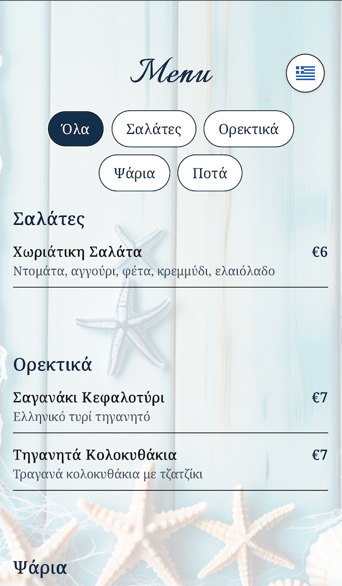

# 🐟 Digital Menu for Traditional Greek Fish Tavern

A simple (Greek/English) mobile-friendly digital menu built for a traditional tavern in Greece. Customers can scan a QR code to instantly view the live menu on their phones.

## Screenshots (Desktop and Mobile)

<table>
  <tr>
    <td>
      
    </td>
    <td>
      
    </td>
  </tr>
</table>

---

## 🌐 Live URL

👉 [https://ax-niko-ax.vercel.app](https://ax-niko-ax.vercel.app)

---

## Technologies Used

- **React** + **TypeScript**
- **Tailwind CSS** for styling
- **Vercel** for free hosting & deployment
- **Google Fonts** for Greek + Latin support
- **QR Code** points to the deployed app

---

## Quick Start

1. **Clone the project**:

   ```bash
   git clone https://github.com/your-username/fish-tavern-menu.git
   cd fish-tavern-menu
   ```

2. **Install dependencies**:

```bash
npm install
```

3. **Run the app\***:

```bash
npm run dev
```

---

### Author

Made by Papadopoulos Ioannis
